# IntroToML
In this repository, we will be exploring and focusing on the IBM Watson Data Platform to dive into working with the Machine Learning pipeline. This will include performing activities from data cleansing using the IBM Data Refinery service to creating a simple machine learning model using the IBM Watson Machine Learning service and creating an interactive dashboard using the Cognos Dashboard Embedded service to visualize data.

This repository used the following resource, which can be explored to look at each part in more depth: 
https://developer.ibm.com/code/labs/Data-Science-Data-Refinery
https://developer.ibm.com/code/howtos/ml-in-minutes
https://developer.ibm.com/code/howtos/create-interactive-dashboards-on-watson-studio

## Sign up on IBM Cloud
An IBM Cloud account - A lite account, which is a free of charge account that doesn’t expire, can be created through going to [IBM Cloud](http://ibm.biz/sheraaml). Make sure to set the region to US South.

## Create a Watson Studio service instance
- Select **Catalog**
- Click on **AI** from the menu on the left
- Select **Watson Studio**.

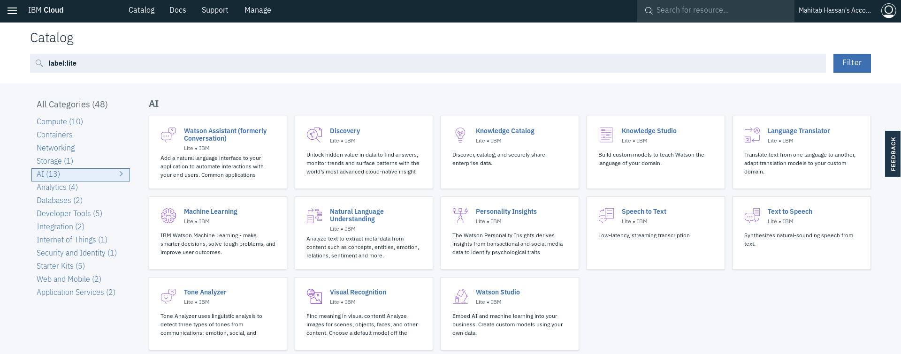

- Enter the **Service name** or keep the default value and make sure to select the **US South** as the **region/location**
- Select **Lite** for the **Plan**, which you can find under **Pricing Plans** and is already selected. Please note you are only allowed one instance of a Lite plan per service
- Click on **Create**

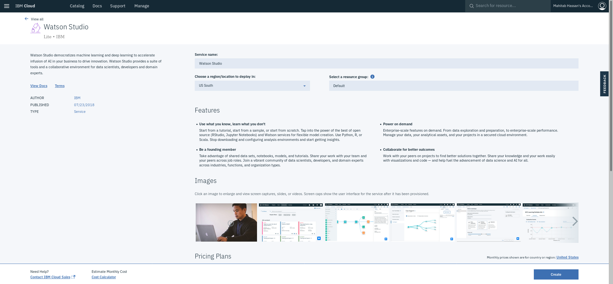

- You will be taken to the main page of the service. Click on **Get Started**. This will take you to the **Watson Studio**

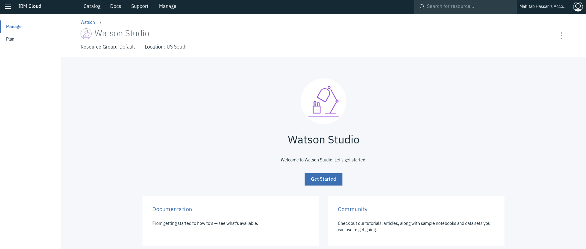

platform. If this is your first time on this platform and you don't have an associated account, you will be asked to **Confirm your IBM Cloud organization and space information**

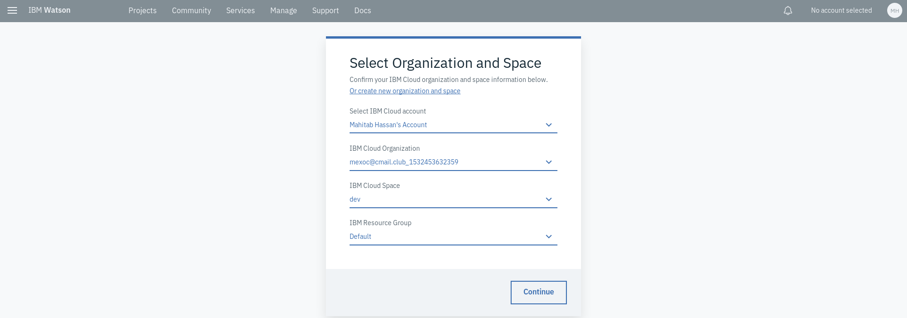

## Create a New Project
- On the **IBM Watson Watson** main page, click on **New project** Under **Get started with key tasks**
- Select **Complete** and click on **Ok**

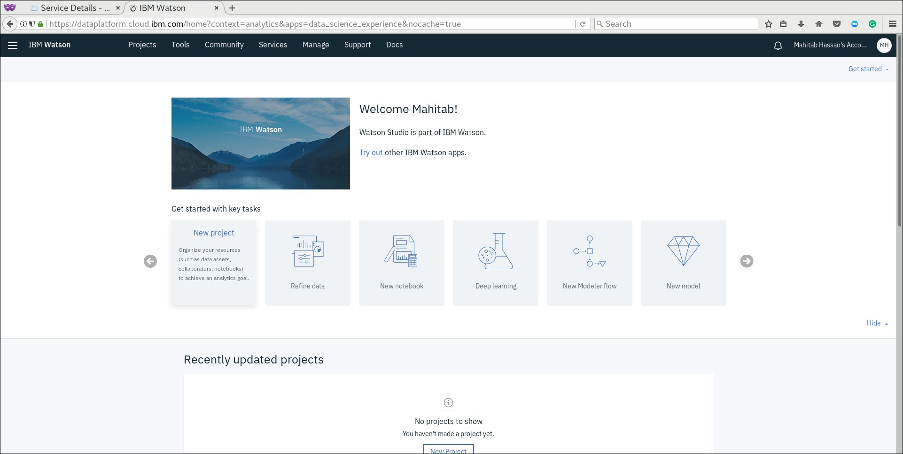

- Enter a **Name** and **Description** for your new to-be-created project
- Under **Define storage**, add a new **IBM Cloud Object Storage** instance by clicking on **Add** under **Select storage service**
- In the new window that gets opened, select **Lite** as the **Plan** and click **Create**
- Enter the **Service name** or keep the default value
- Click on **Confirm**

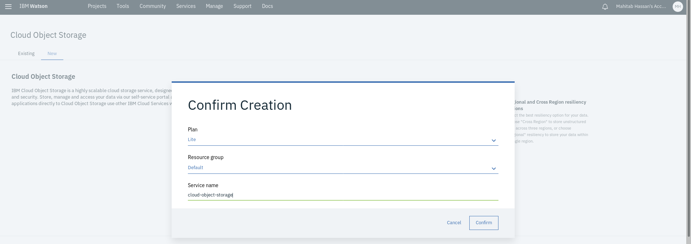

- Click on **Refresh** to see the newly created service instance and get it selected
- You can select to **Restrict who can be a collaborator** under **Choose project options** if you wish to do so at this stage
- Click on **Create**

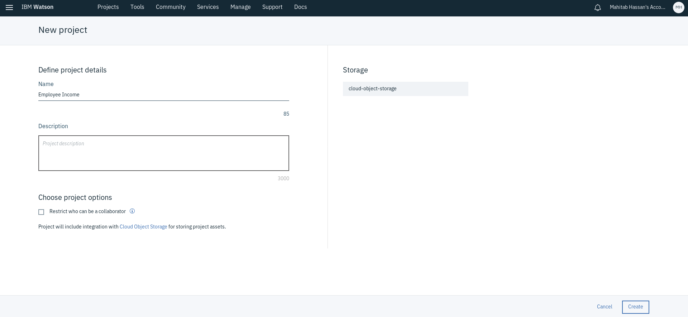

## Adding the data assets
- You should be taken to a page showing an **Overview** of the project you just created
- Click on **Assets** on the panel found under the name of your project at the top of the page
- At the top right of the page, click on the icon that has zeros and ones (two of each)
- Click on **Load** and drag and drop the files **adult_income.csv**, which can be found this GitHub repository under the folder **Data sets**.

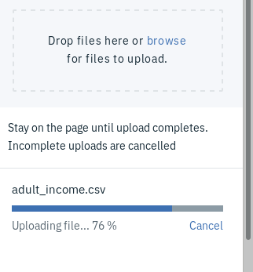

- You will notice that once the files are uploaded, they will be added under **Data assets**.

## Part 1: Data Refinery
- Go to the triple dot menu next to next to **adult_income.csv** under **Data assets** and select **Refine**

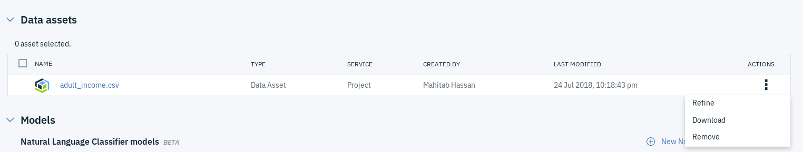

- On the panel on the right, you will find **Details** including the project the data asset belongs to, and description of the resulting data set we will get after the refining process. Close it for the time being

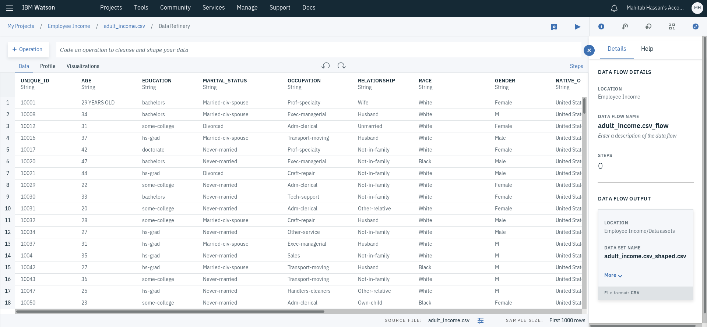

- Click on **Steps**, which you can find right hand-side of the page. This is where you will see each operation you will define while transforming the data. It shows the data flow defining the operations to be done on the entire data set

- Click on the **Profile** tab and talk quick look at data summary and get a feel of you data (do this after skimming through your data displayed in the **Data** tab)

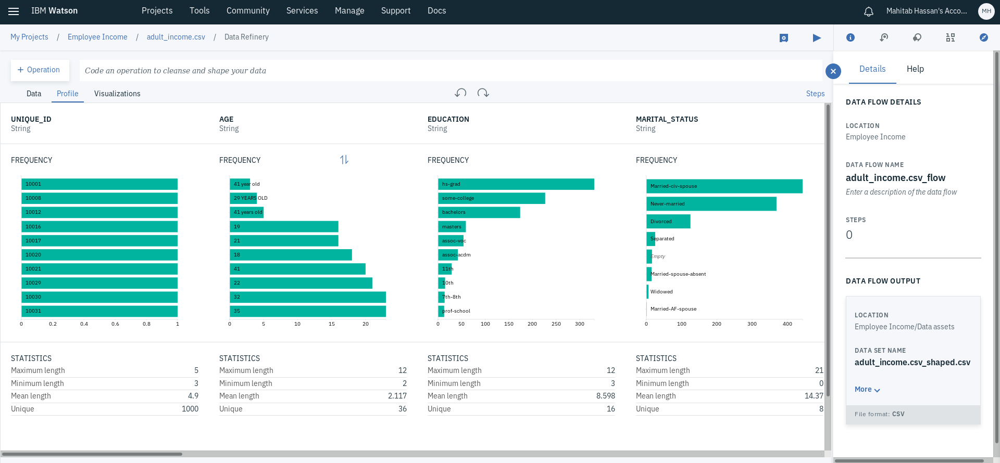

- Click on the **Profile** tab and take a closer look at the column *GENDER*. You will notice some additional values other than *Male* and *Female*, mainly ones that we want to change to *Male*.

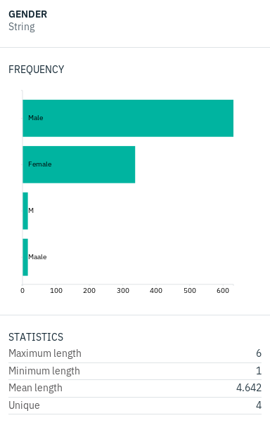

- Click on **+Operation** and select **Replace substring**, which you can find under **CLEANSE**.
- Choose *GENDER* as the **Selected column**. Under **Pattern** tab, type <i>^(?!(Male|Female))([Mm].*)</i> under **Regular expression** and *Male* under **Enter the string replace with**. Make sure to select **Replace all occurrences**.

What is meant by <i>^(?!(Male|Female))([Mm].*)</i> is to find any expression that doesn't start with *Male* or *Female* and starts with the letter *M* or *m*, which could be followed by any character.

- Click **Apply** and go to the **Profile** tab again to for a final check.

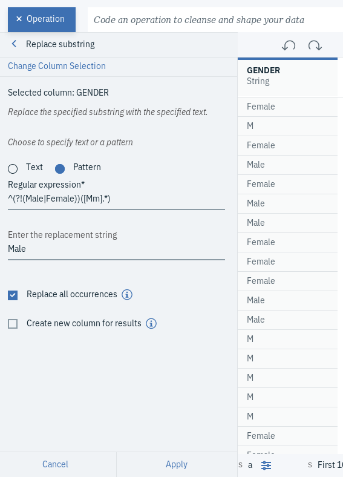

- Click on the **Profile** tab and take a closer look at the column *AGE*

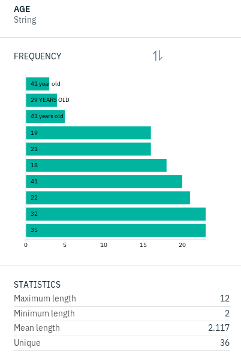

- Click on **+Operation** and select **Split column**, which you can find under **ORGANIZE**.
- Choose *AGE* as the **Selected column**. Under **POSITION** tab, type *2* under **Positions** and *AGE_num,AGE_str* under the **Names of new columns**. Make sure to unselect **Keep original column**
- Click **Apply**.

Bear in mind that this is not the best approach to handle this. This is just provide an example of how to use the **split column** operation.

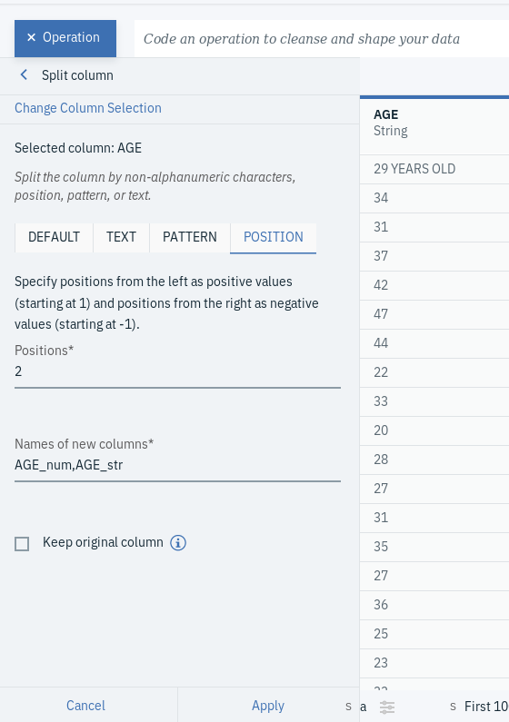

- Go to the **Data** tab and remove the newly created column called *AGE_str*, which only contain the string part of the age.

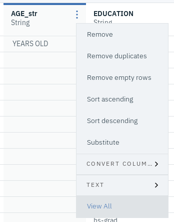

- Go to column called *AGE_num* and rename it to *AGE*

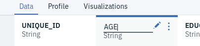

- Go to the **Profile** tab again to for a final check.

- Click on the **Profile** tab and take a closer look at the column *MARITAL_STATUS*

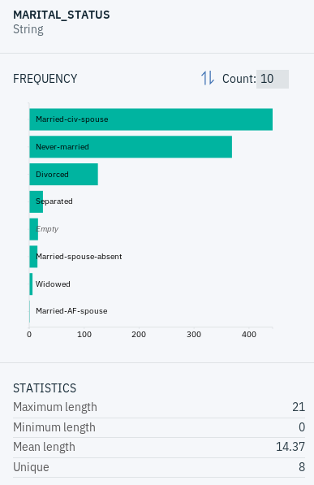

- Go to the **Data** tab
- Go to the column called *MARITAL_STATUS* and remove rows with any empty values by clicking on the triple dot menu next to the column name and selecting **Remove empty rows**

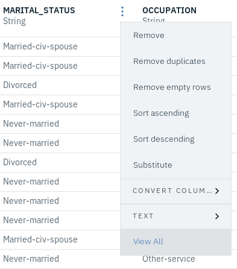

- Go to the **Profile** tab to check if all empty values have been removed.

- Go to the **Data** tab.
- Go to the column called *AGE* and change its type to Integer by clicking on the triple dot menu next to the column name and selecting **CONVERT COLUMN TYPE** followed by selecting **Integer**.

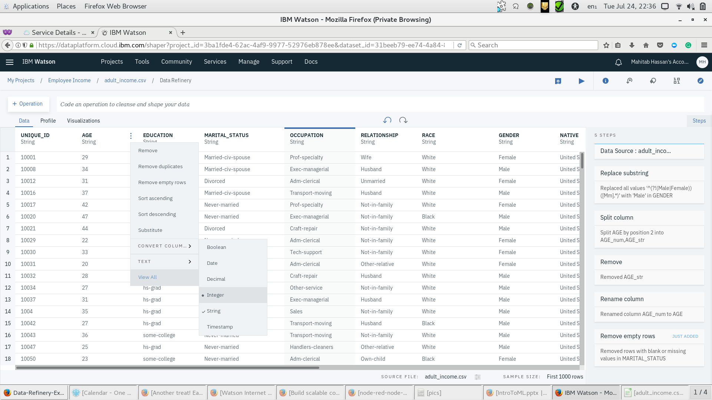

- In the same way, change the data type of *HOURS_PER_WEEK* and INCOME_NUM* to **Integer**, and *CAPITAL_GAIN* and *CAPITAL_LOSS* to **Decimal**.

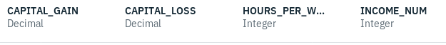

- At this point, you should have 10 **Steps**
- Click on the play button to run the data flow as seen below.

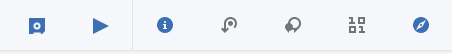

- Change the **Name** under **Data flow details** to *adult_income.csv_flow* and the **Name** under **Data flow output** to *adult_income_shaped.csv*.
- Click on **Save and Run**

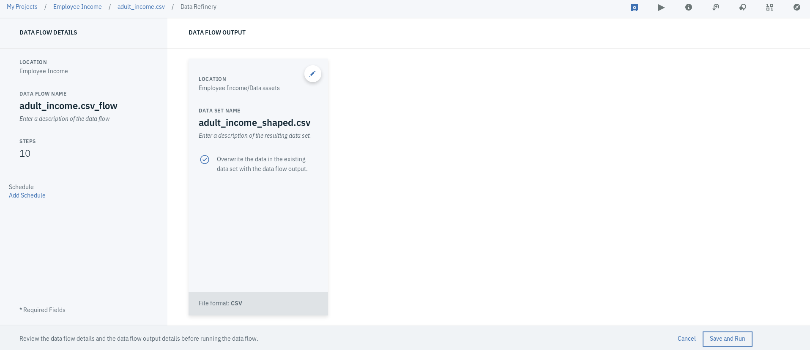

- In the window that pops up, click on **View Flow** to track the progress of the running data flow.

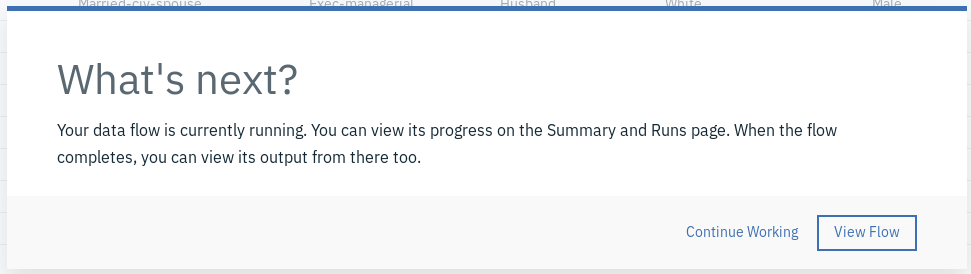

- The data flow should start running, executing each of the operations we defined. If things goes well, you should see the page similar to the one displayed below.

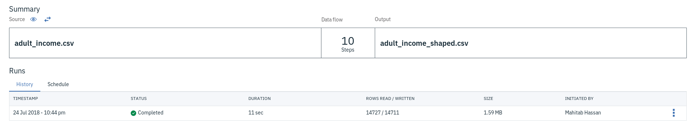

## Part 2: Interactive Dashboard
- Go to the Dashboards section and click on **New dashboard**

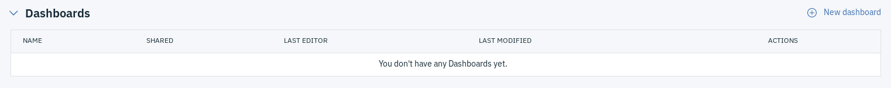

- Enter a **Name** and **Description** for your new to-be-created dashboard
- Under **Associate a Cognos Dashboard Embedded service instance**, add a new **Cognos Dashboard Embedded** instance by clicking on the link

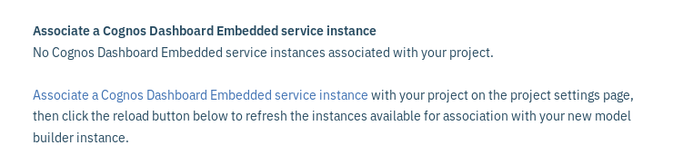

- In the new window that gets opened, select **Lite** as the **Plan** and click **Create**
- Enter the **Service name** or keep the default value

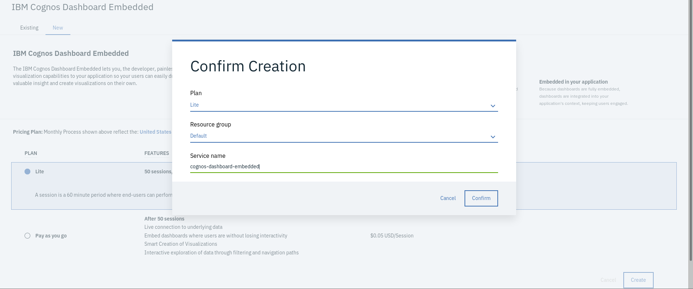

- Click on **Confirm**
- Click on **Refresh** to see the newly created service instance and select it
- Click **Save**

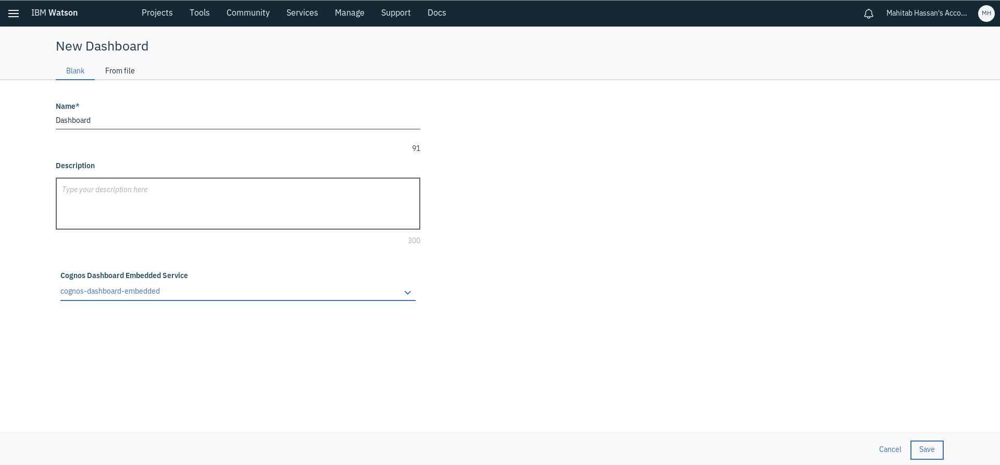

- Select a template for your dashboard. You have 3 options: Single page, Tabbed, or Infographic. Select **Infographic**

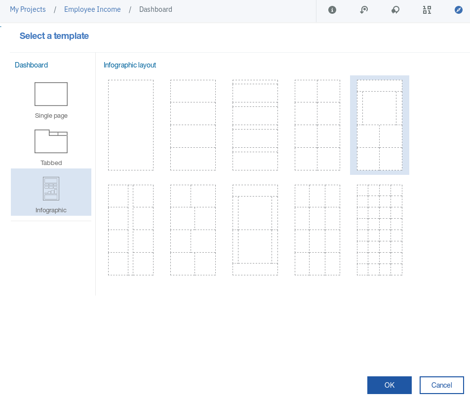

- Click **OK**

- From the panel on the left in the Data section, click **Selected sources** to define the data source
- Click on *adult_income_shaped.csv* and click **Select**

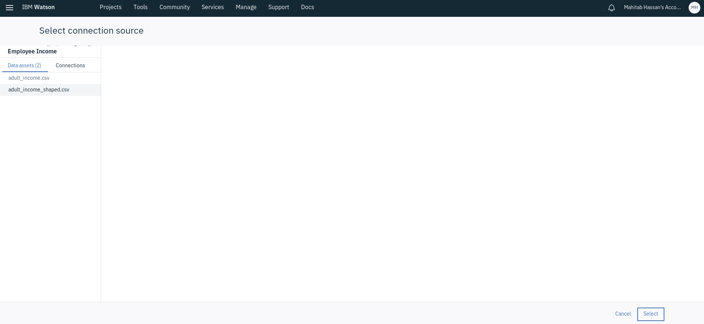

- Click on the added data set to expand its field and start working with it

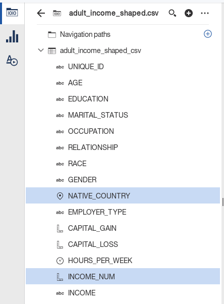

- To create the first visualization, select *NATIVE_COUNTRY* and *INCOME_NUM* and drag them onto the infographic template

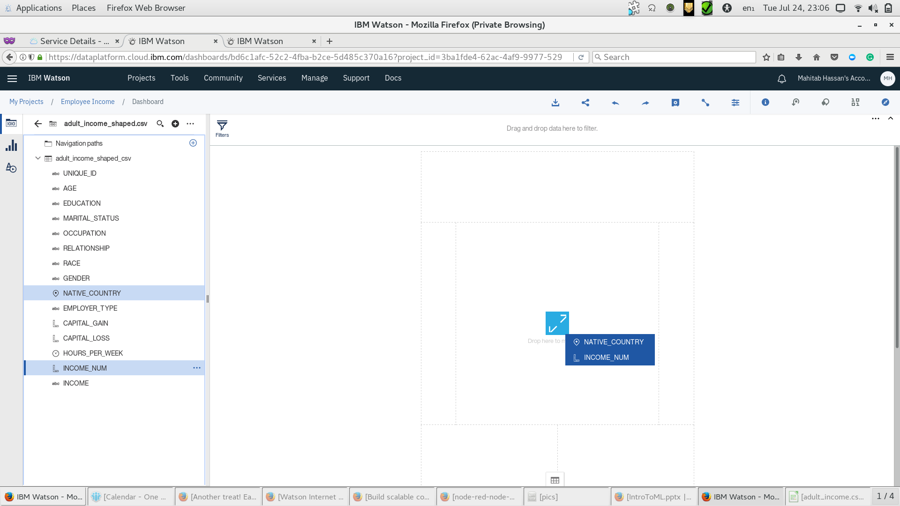

- You will see that a Map as selected as the default type of visualization in this case. Keep it
- Click on the small window with an arrow at the top left of the vissualization to explore more options
- Click on the triple dots beside *INCOME_NUM*, select **Summarize** and click on **Average**

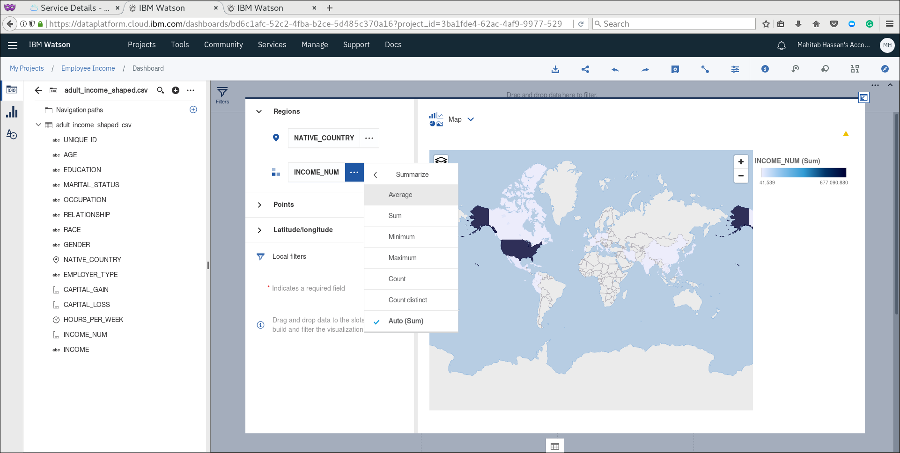

- Select *MARITAL_STATUS* and drag onto the templete to create the next visualization
- Set the visualization to a **Pie** chart
- Configure it and select **Count** under **Summarize**

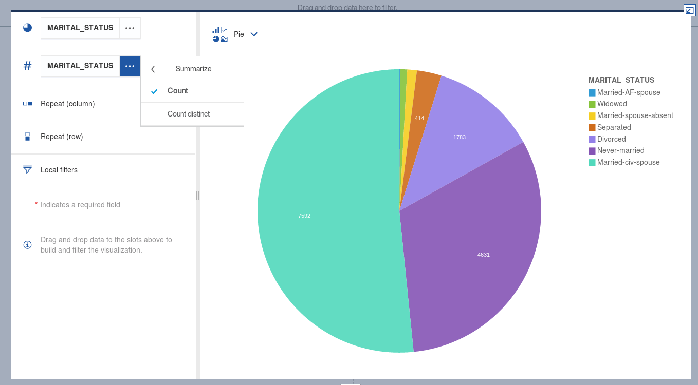

- Continue to add more visualizations to explore your data and gain valuable insights

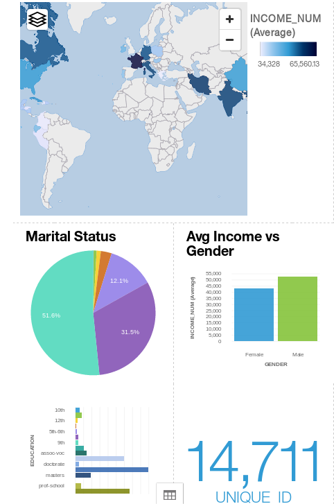

- Add a title to your infographic
- Click Save once finished editing 
- Click on the Share button to create a Permalink to a Read-only version of the dashboards you created

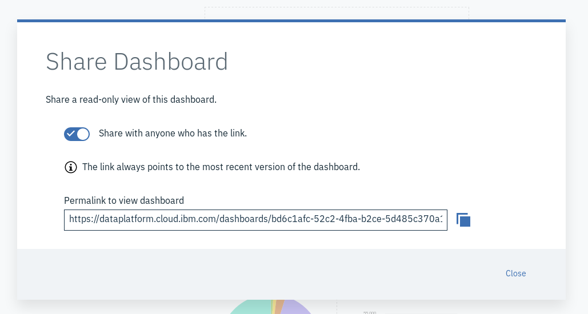

- You can check an example dashboard that you can interact with this [link](https://dataplatform.cloud.ibm.com/dashboards/bd6c1afc-52c2-4fba-b2ce-5d485c370a16/view/4428a479379c0c9e6abdd0e4079a7e577c617108b6bb8501d1d67b495e367897a8601496c82a4953dd175031fbeb1a0c9c)

## Part 3: Deploy a Machine Learning Model
- Click on **New Watson Machine Learning model** in the Watson Machine Learning models section

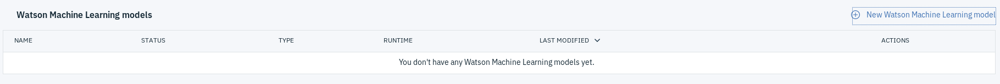

- Enter a **Name** and **Description** for your new to-be-created model
- Under **Machine Learning Service**, add a new instance by clicking on the link

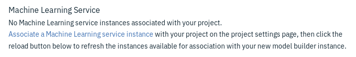

- In the new window that gets opened, select **Lite** as the **Plan** and click **Create**
- Enter the **Service name** or keep the default value

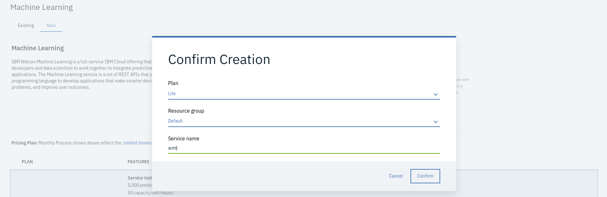

- Click on **Confirm**
- Click on **Refresh** to see the newly created service instance and select it

- Under **Spark Service**, add a new instance by clicking on **Associate an IBM Analytics for Apache Spark instance**

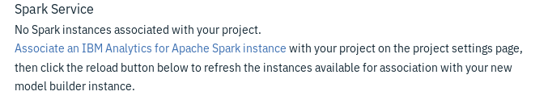

- In the new window that gets opened, select **Lite** as the **Plan** and click **Create**
- Enter the **Service name** or keep the default value

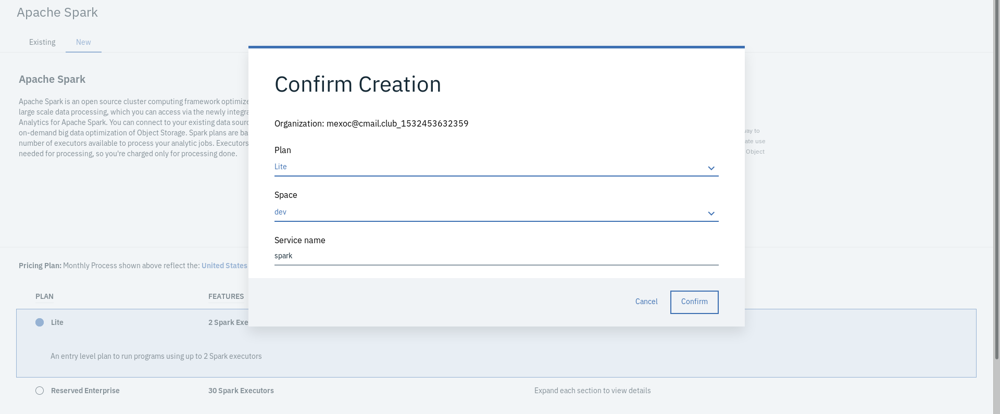

- Click on **Confirm**
- Click on **Refresh** to see the newly created service instance and select it
- Select **Model builder** as the model type
- Select **Manual** to allow you to prepare your own data and select the model to train
- Click **Create**

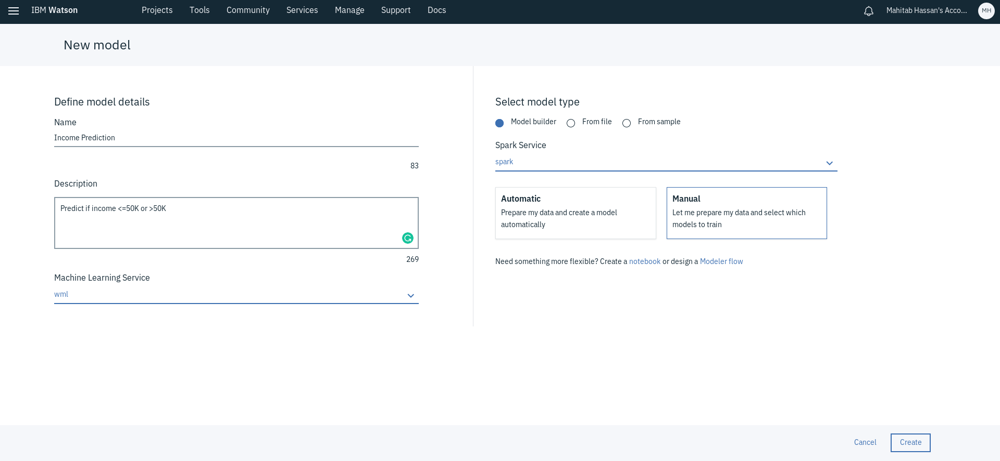

- Select the data set to work with (in this case *adult_income_shaped.csv*)

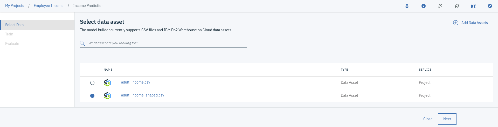

- Click **Next**
- Select *INCOME(String)* as the label column and everything else excluding *UNIQUE_ID* and *INCOME_NUM* as the feature columns
- Select **Binary Classification** and leave the **Validation Split** as it is

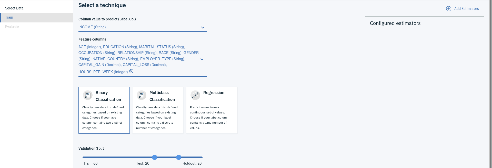

- Click on **Add Estimators**
- Select all estimator from which the best performing one will be selected later

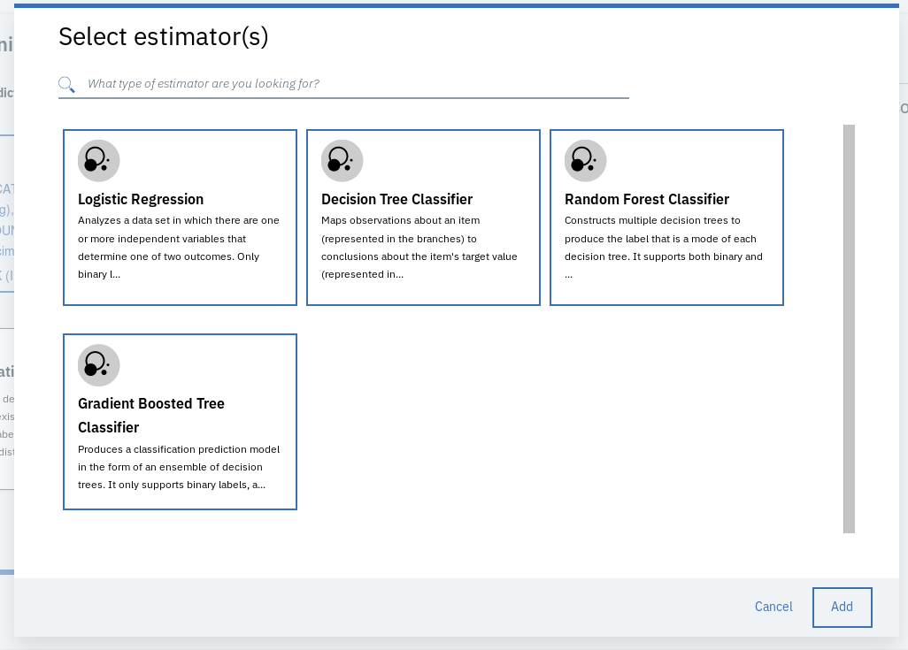

- Click **Next**
- Select **LogisticRegression** and click **Save** to save the model best fit to the data

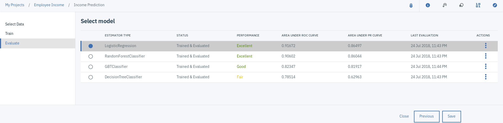

- You can deploy the model by going to **Deployments** tab and clicking on **Add Deployment**

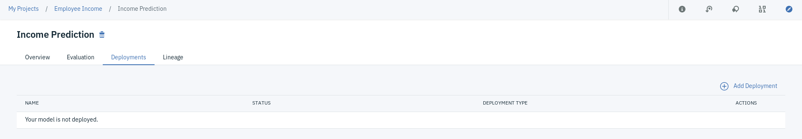

- Insert a **Name** and **Description** for the deployment 
- Select **Web service** as the **Deployment type** 

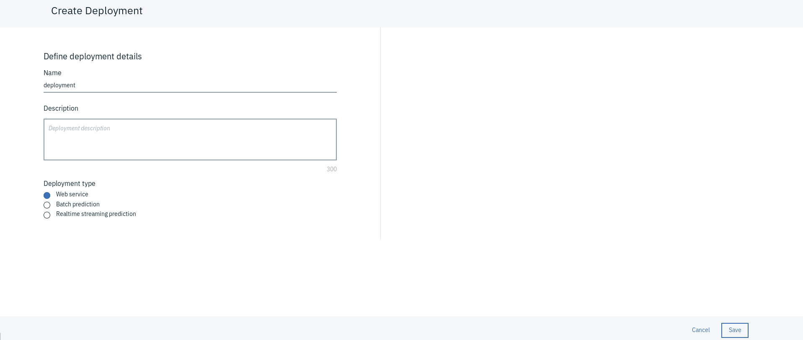

- You can check sample code that can be used for implementation purposes by going to **Implementation** tab

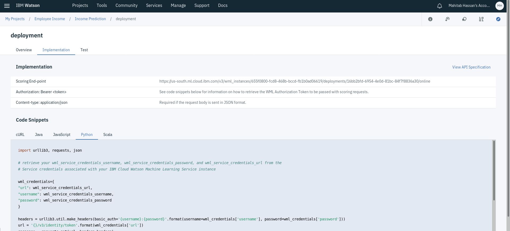

- You can test out the model by going to **Test** tab and filling in the values of the features (a json object can also be used)

And this marks the end of the exercise
